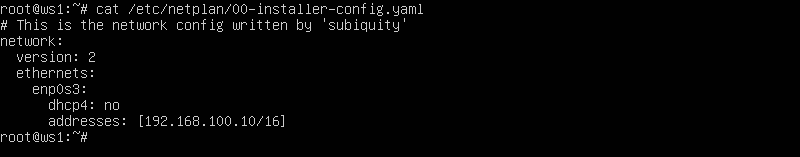
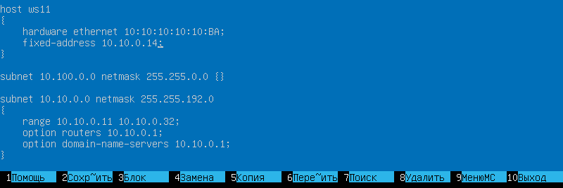
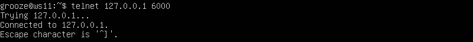

### В заданиях проекта указаны сетевые интерфейсы `eth0` и `eth1`.
### Поскольку используются виртуальные сетевые интерфейсы Virtualbox,
### то в скринах они будут отображаться соответственно - `enp0s3` и `enp0s8`... 

## Part 1. Инструмент ipcalc

### 1.1. Сети и маски
#### 1) адрес сети *192.167.38.54/13*
    192.160.0.0

#### 2) перевод маски *255.255.255.0* в префиксную и двоичную запись:

    /24, 11111111.11111111.11111111.00000000

#### */15* в обычную и двоичную:

    255.254.0.0, 11111111.11111110.00000000.00000000

#### 11111111.11111111.11111111.11110000 в обычную и префиксную:

    255.255.255.240, /28

#### 3) минимальный и максимальный хост в сети 12.167.38.4 при масках:

*/8*

    12.0.0.1 - 12.255.255.254

*11111111.11111111.00000000.00000000*

    12.167.0.1 - 12.167.255.254
  
*255.255.254.0*
  
    12.167.38.1 - 12.167.39.254
  
   */4*

    0.0.0.1 - 15.255.255.254

### 1.2. localhost
#### Определить и записать в отчёт, можно ли обратиться к приложению, работающему на localhost, со следующими IP: *194.34.23.100*, *127.0.0.2*, *127.1.0.1*, *128.0.0.1*

    Из перечисленных можно только по 127.0.0.2 и 127.1.0.1

### 1.3. Диапазоны и сегменты сетей
#### Определить и записать в отчёт:
#### 1) какие из перечисленных IP можно использовать в качестве публичного, а какие только в качестве частных:

    *10.0.0.45* - частный
    *134.43.0.2* - публичный
    *192.168.4.2* - частный
    *172.20.250.4* - частный
    *172.0.2.1* - публичный
    *192.172.0.1* - публичный
    *172.68.0.2* - публичный
    *172.16.255.255* - частный
    *10.10.10.10* - частный
    *192.169.168.1* - публичный
#### 2) какие из перечисленных IP адресов шлюза возможны у сети *10.10.0.0/18*:

    *10.0.0.1* - НЕвозможен
    *10.10.0.2* - возможен
    *10.10.10.10* - возможен
    *10.10.100.1* - НЕвозможен
    *10.10.1.255* - возможен

## Part 2. Статическая маршрутизация между двумя машинами

#### Поднять две виртуальные машины (далее -- ws1 и ws2)

#### С помощью команды `ip a` посмотреть существующие сетевые интерфейсы

ws1


ws2


#### Описать сетевой интерфейс, соответствующий внутренней сети, на обеих машинах и задать следующие адреса и маски: ws1 - *192.168.100.10*, маска */16*, ws2 - *172.24.116.8*, маска */12*

ws1



ws2


#### Выполнить команду `netplan apply` для перезапуска сервиса сети
На следующих скринах перезапускается сеть на ws1 и ws2 соответственно и командой "ip a" показано, что каждая из машин получила свой ip адрес:


### 2.1. Добавление статического маршрута вручную
#### Добавить статический маршрут от одной машины до другой и обратно при помощи команды вида `ip r add`
#### Пропинговать соединение между машинами

Применение команды "ip r add" на ws1 и ping ws1 -> ws2


Применение команды "ip r add" на ws2 и ping ws2 -> ws1


### 2.2. Добавление статического маршрута с сохранением
#### Перезапустить машины
#### Добавить статический маршрут от одной машины до другой с помощью файла *etc/netplan/00-installer-config.yaml*

ws1


ws2


#### Пропинговать соединение между машинами
На скринах ниже показан собственный ip адрес каждой из машин (командой "ip a") и успешные результаты применения команды "ping" друг к другу

ws1


ws2


## Part 3. Утилита **iperf3**

### 3.1. Скорость соединения
#### Перевести и записать в отчёт: 8 Mbps в MB/s, 100 MB/s в Kbps, 1 Gbps в Mbps

```
При переводе из "бит в секунду" в "байт в секунду" учитываем, что в одном килобите 1000 бит,
а в одном килобайте - 1024 байт, исходя из этого высчитываем следующие результаты:

8 Mbps = 1 MB/s
100 MB/s = 819200 Kbps
1 Gbps = 1024 Mbps
```

### 3.2. Утилита **iperf3**
#### Измерить скорость соединения между ws1 и ws2

iperf3 на ws1


iperf3 на ws2


## Part 4. Сетевой экран

### 4.1. Утилита **iptables**

#### Создаем файл /etc/firewall.sh, имитирующий фаерволл, на ws1 и ws2:
Скрины с содержанием файла */etc/firewall* для каждой машины:

ws1


ws2


#### Запускаем файлы на обеих машинах командами `chmod +x /etc/firewall.sh` и `/etc/firewall.sh`

ws1


ws2


```
Разница между стратегиями: в первом файле первым подходящим правилом для пакета является запрет,
а во втором - разрешение. Применяется только первое подходящее правило, остальные - игнорируются.
```

### 4.2. Утилита **nmap**
#### Командой **ping** находим машину, которая не "пингуется", утилитой **nmap** показываем, что хост машины запущен
*Проверка: в выводе nmap должно быть сказано: `Host is up`*

ws1 с ws2 не пингуется


ws2 c ws1 пингуется


утилита **nmap** показывает, что хост ws1 запущен


## Part 5. Статическая маршрутизация сети

#### Поднять пять виртуальных машин (3 рабочие станции (ws11, ws21, ws22) и 2 роутера (r1, r2))


### 5.1. Настройка адресов машин
#### Настроить конфигурации машин в *etc/netplan/00-installer-config.yaml* согласно сети на рисунке.

Скрины с содержанием файла *etc/netplan/00-installer-config.yaml* для каждой машины:

ws11


ws21


ws22


r1


r2


#### Перезапускаем сервис сети. Командой `ip -4 a` проверяем, что адреса машин заданы верно:

ws11


ws21


ws22


r1


r2


#### Также пропинговать ws22 с ws21. Аналогично пропинговать r1 с ws11.

ws21 -> ws22


ws11 -> r1


### 5.2. Включение переадресации IP-адресов.
#### Для включения переадресации IP, выполните команду на роутерах:
`sysctl -w net.ipv4.ip_forward=1`
*При таком подходе переадресация не будет работать после перезагрузки системы.*

r1


r2


#### Откройте файл */etc/sysctl.conf* и добавьте в него следующую строку:
`net.ipv4.ip_forward = 1`
*При использовании этого подхода, IP-переадресация включена на постоянной основе.*

На следующем скрине изображена вставка нужной строки (скрин совершенно одинаковый для обоих роутеров)


### 5.3. Установка маршрута по-умолчанию
Пример вывода команды `ip r` после добавления шлюза:
```
default via 10.10.0.1 dev eth0
10.10.0.0/18 dev eth0 proto kernel scope link src 10.10.0.2
```


#### Настроить маршрут по-умолчанию (шлюз) для рабочих станций. Для этого добавить `default` перед IP роутера в файле конфигураций

Скрины с содержанием файла *etc/netplan/00-installer-config.yaml*:

ws11


ws21


ws22


r1


r2


#### Вызвать `ip r` и показать, что добавился маршрут в таблицу маршрутизации


#### Пропинговать с ws11 роутер r2 и показать на r2, что пинг доходит. Для этого использовать команду:
`tcpdump -tn -i eth1`

Пинг ws11 -> r2 доходит


На r2 команда `tcpdump -tn -i eth1` показывает, что пакеты принимаются


### 5.4. Добавление статических маршрутов
#### Добавить в роутеры r1 и r2 статические маршруты в файле конфигураций. Пример для r1 маршрута в сетку 10.20.0.0/26:
```shell
# Добавить в конец описания сетевого интерфейса eth1:
- to: 10.20.0.0
  via: 10.100.0.12
```
Скрины с содержанием изменённого файла *etc/netplan/00-installer-config.yaml* для каждого роутера:

r1


r2


#### Вызвать `ip r` и показать таблицы с маршрутами на обоих роутерах. Пример таблицы на r1:
```
10.100.0.0/16 dev eth1 proto kernel scope link src 10.100.0.11
10.20.0.0/26 via 10.100.0.12 dev eth1
10.10.0.0/18 dev eth0 proto kernel scope link src 10.10.0.1
```

Команда "ip r" на r1


Команда "ip r" на r2


#### Запустить команды на ws11:
`ip r list 10.10.0.0/[маска сети]` и `ip r list 0.0.0.0/0`

Скрин с вызовом и выводом использованных команд.


- В отчёте объяснить, почему для адреса 10.10.0.0/\[маска сети\] был выбран маршрут, отличный от 0.0.0.0/0, хотя он попадает под маршрут по-умолчанию.
```
Маршрут по умолчанию (через шлюз) имеет меньший приоритет, нежели чем таблица маршрутизации.
Для сети 10.10.0.0 создано правило и используется прописанный в нем маршрут. Приоритеты маршрутов
можно изменять установкой метрики.
```
### 5.5. Построение списка маршрутизаторов
Пример вывода утилиты **traceroute** после добавления шлюза:
```
1 10.10.0.1 0 ms 1 ms 0 ms
2 10.100.0.12 1 ms 0 ms 1 ms
3 10.20.0.10 12 ms 1 ms 3 ms
```
#### Запустить на r1 команду дампа:
`tcpdump -tnv -i eth0`
##### При помощи утилиты **traceroute** построить список маршрутизаторов на пути от ws11 до ws21

Команду "traceroute" запускаем на ws11


А на r1 запускаем команду "tcpdump"


- В отчёте, опираясь на вывод, полученный из дампа на r1, объяснить принцип работы построения пути при помощи **traceroute**
```
Принцип построения пути при помощи traceroute:
Для определения промежуточных маршрутизаторов traceroute отправляет серию пакетов данных целевому узлу,
при этом каждый раз увеличивая на 1 значение поля TTL («время жизни»). Это поле обычно указывает
максимальное количество маршрутизаторов, которое может быть пройдено пакетом. Первый пакет отправляется с TTL,
равным 1, и поэтому первый же маршрутизатор возвращает обратно сообщение ICMP, указывающее на невозможность
доставки данных. Traceroute фиксирует адрес маршрутизатора, а также время между отправкой пакета и
получением ответа (эти сведения выводятся на монитор компьютера). Затем traceroute повторяет отправку пакета,
но уже с TTL, равным 2,
что позволяет первому маршрутизатору пропустить пакет дальше.
Процесс повторяется до тех пор, пока при определённом значении TTL пакет не достигнет целевого узла.
При получении ответа от этого узла процесс трассировки считается завершённым.
```
### 5.6. Использование протокола **ICMP** при маршрутизации
#### Запустить на r1 перехват сетевого трафика, проходящего через eth0 с помощью команды:
`tcpdump -n -i eth0 icmp`

r1


#### Пропинговать с ws11 несуществующий IP

ws11


## Part 6. Динамическая настройка IP с помощью **DHCP**

### Для r2 настроить в файле */etc/dhcp/dhcpd.conf* конфигурацию службы **DHCP**:
#### 1) указать адрес маршрутизатора по-умолчанию, DNS-сервер и адрес внутренней сети. Пример файла для r2:
```
subnet 10.100.0.0 netmask 255.255.0.0 {}

subnet 10.20.0.0 netmask 255.255.255.192
{
    range 10.20.0.2 10.20.0.50;
    option routers 10.20.0.1;
    option domain-name-servers 10.20.0.1;
}
```
Фрагмент содержания измененного файла */etc/dhcp/dhcpd.conf*


#### 2) в файле *resolv.conf* прописать `nameserver 8.8.8.8.`

Фрагмент содержания измененного файла *resolv.conf*


#### Перезагрузить службу **DHCP** командой `systemctl restart isc-dhcp-server`. Машину ws21 перезагрузить при помощи `reboot` и через `ip a` показать, что она получила адрес. Также пропинговать ws22 с ws21.

Перезагрузка службы DHCP


Видим, что сервер DHCP выдал для ws21 первый из указанного диапазона ip адрес.

Также пингуется и ws22 c ws21


#### Указать MAC-адрес у ws11, для этого в *etc/netplan/00-installer-config.yaml* надо добавить строки: `macaddress: 10:10:10:10:10:BA`, `dhcp4: true`

Скрин с содержанием изменённого файла *etc/netplan/00-installer-config.yaml*.


### Для r1 настроить аналогично r2, но сделать выдачу адресов с жесткой привязкой к MAC-адресу (ws11). Провести аналогичные тесты

Настраиваем r1 по аналогии с r2: в файле */etc/dhcp/dhcpd.conf* прописываем блок фиксированной привязки ip адреса к MAC-адресу ws11, начинающийся словами "host ws11":



Затем в файле *resolv.conf* прописываем `nameserver 8.8.8.8`:


После перезагрузки службы DHCP вводим команду "ip a" и видим, что ws11 получил новый ip адрес, который был привязан к MAC-адресу:


### Запросить с ws21 обновление ip адреса

Скрин ip до и после обновления:


В отчёте описать, какими опциями **DHCP** сервера пользовались в данном пункте.
```
Пользовался командой dhclient - (-r для очистки имеющегося ip адреса) и просто без опций для запроса
нового ip адреса от dhcp сервера
```

## Part 7. **NAT**

#### В файле */etc/apache2/ports.conf* на ws22 и r1 изменить строку `Listen 80` на `Listen 0.0.0.0:80`, то есть сделать сервер Apache2 общедоступным

Скрин с содержанием изменённого файла.


#### Запустить веб-сервер Apache командой `service apache2 start` на ws22 и r1

ws22 (запускаем сервер Apache2):


r1 (запускаем сервер Apache2):


ws22 (командой `"ps -A"` проверяем, что сервер запущен):


r1 (командой `"ps -A"` проверяем, что сервер запущен):


#### Добавить в фаервол, созданный по аналогии с фаерволом из Части 4, на r2 следующие правила:
##### 1) удаление правил в таблице filter - `iptables -F`
##### 2) удаление правил в таблице "NAT" - `iptables -F -t nat`
##### 3) отбрасывать все маршрутизируемые пакеты - `iptables --policy FORWARD DROP`

Фрагмент измененного файла "/etc/firewall.sh"


##### Запускаем файл также, как в Части 4


##### Проверить соединение между ws22 и r1 командой `ping`
*При запуске файла с этими правилами, ws22 не должна "пинговаться" с r1*

Не пингуется


#### Добавить в файл ещё одно правило:
##### 4) разрешить маршрутизацию всех пакетов протокола **ICMP**

Фрагмент измененного файла "/etc/firewall.sh"


##### Запускаем файл также, как в Части 4


##### Проверить соединение между ws22 и r1 командой `ping`
*При запуске файла с этими правилами, ws22 должна "пинговаться" с r1*

Пингуется


#### Добавить в файл ещё два правила:
##### 5) включить **SNAT**, а именно маскирование всех локальных ip из локальной сети, находящейся за r2 (по обозначениям из Части 5 - сеть 10.20.0.0)

##### 6) включить **DNAT** на 8080 порт машины r2 и добавить к веб-серверу Apache, запущенному на ws22, доступ извне сети

Фрагмент измененного файла "/etc/firewall.sh"


##### Запускаем файл также, как в Части 4


##### Проверить соединение по TCP для **SNAT**, для этого с ws22 подключиться к серверу Apache на r1 командой:
`telnet [адрес] [порт]`

Соединение установлено


##### Проверить соединение по TCP для **DNAT**, для этого с r1 подключиться к серверу Apache на ws22 командой `telnet` (обращаться по адресу r2 и порту 8080)

Соединение установлено


## Part 8. Дополнительно. Знакомство с **SSH Tunnels**

#### Запустить на r2 фаервол с правилами из Части 7

Запускаем фаервол на r2 со следующими правилами:


#### Запускаем веб-сервер **Apache** на ws22 на localhost (в файле */etc/apache2/ports.conf* изменяем строку `Listen 80` на `Listen localhost:80`)

Изменили localhost:


Стартуем Apache2:


Через команду `"ps -A"` убеждаемся, что запущен:


#### Воспользоваться *Local TCP forwarding* с ws21 до ws22, чтобы получить доступ к веб-серверу на ws22 с ws21

Воспользуемся на ws21 командой: ssh -L 5000:localhost:80 10.20.0.20


#### Воспользоваться *Remote TCP forwarding* с ws11 на ws22, чтобы получить доступ к веб-серверу на ws22 с ws11

Воспользуемся на ws22 командой: ssh -R 6000:localhost:80 grooze@10.10.0.2


#### Для проверки, сработало ли подключение в обоих предыдущих пунктах, перейдите во второй терминал (например, клавишами Alt + F2) и выполните команду:
`telnet 127.0.0.1 [локальный порт]`

Оба подключения установлены:



